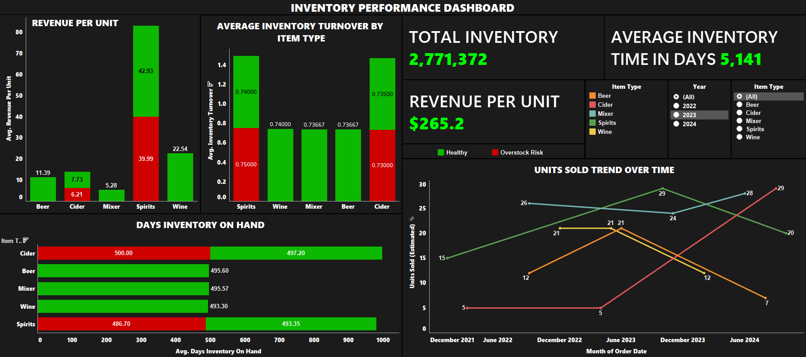

# Shelf Life: Analyzing Turnover & Overstock Risk in Retail Inventory

### 📌 Project Summary

This project focuses on understanding how inventory is performing across a retail operation with over **$2.7M in stock**. Using a dataset of **44,000+ records**, I explored inventory turnover, flagged underperforming SKUs, and identified where stock was sitting too long without moving. The goal was to help the business reduce overstock costs while maintaining product availability.

All insights are presented through a **fully interactive Tableau dashboard**, making it easy for inventory managers and buyers to make informed, data-backed decisions.

---
### 📰 Dashboard Image and Tableau Public Link [🔗](https://public.tableau.com/app/profile/vedant.shinde2971/viz/Tableau_17434692686900/Dashboard)

---

## 🎯 Objective

Help retail teams manage inventory more efficiently by identifying slow-moving items, monitoring supplier performance, and improving overall turnover using key metrics.

---

## 🔍 Key Questions

- Are we holding too much inventory that isn’t selling?
- Which products have the highest Days Inventory Outstanding (DIO)?
- Where are we losing money due to idle stock?
- Are there patterns by category or supplier?

---

## 📊 KPIs Included

- Inventory Turnover Ratio  
- Days Inventory on Hand (DIO)  
- Revenue per Unit  
- Units Sold  
- Average Inventory Value  
- Stock Status (e.g., Overstock Risk vs. Healthy)

---

## 🛠️ Tools Used

- **SQL** – Data prep, cleaning, and KPI calculations  
- **Excel** – Initial exploration and basic cleaning  
- **Tableau** – Final dashboard and visualizations  
- **Regex in SQL** – To validate formatting of numeric fields  

---

## 🧪 What I Worked On

### Data Cleaning & Prep in Excel
- Cleaned and standardized a 44,000-row dataset  
- Fixed over **1,000+ missing or inconsistent values**  
- Normalized fields like `item_type` and `supplier` for consistency

### KPI Calculation in SQL  
- Calculated inventory turnover, DIO, units sold, and more  
- Identified SKUs with over **500+ days of holding time**  
- Flagged over **$180K** in idle inventory at risk of becoming dead stock

### Dashboard Design in Tableau  
- Built bar charts, line charts, and category-level breakdowns  
- Added filters for year and product type for better usability  
- Included status flags to highlight high-risk inventory

---

## 👤 Intended Users

This dashboard and analysis are built for:
- Inventory & Supply Chain Managers  
- Category Buyers  
- Merchandising Teams  
- Finance Analysts tracking working capital

---

## ✅ Key Results

- Highlighted slow-moving SKUs and stockpiled items
- Helped surface over **$180K+ in excess inventory**
- Provided a clear view of inventory efficiency by category and supplier
- Created a tool to support markdowns, delisting, or restocking decisions

---

## 📁 Files Included

- `Inventory_Analytics_Unclean.csv` – Uncleaned dataset  
- `inventory.csv` – Cleaned dataset  
- `Inventory_KPI.csv` – Calculated metrics summary  
- `Dashboard.png` – Screenshot of Tableau dashboard  
- `Tableau.twb` – Tableau workbook  
- `Project Objectives.docx` – Full scope and goals of the project  

---

## 📎 Dataset Source

[Warehouse and Retail Sales – Data.gov](https://catalog.data.gov/dataset/warehouse-and-retail-sales)

---

## 💡 About This Project

This project was built as a hands-on way to apply data analytics skills to a real-world retail inventory scenario. It combines business thinking with technical execution, showing how data can directly inform operational decisions in retail environments.
