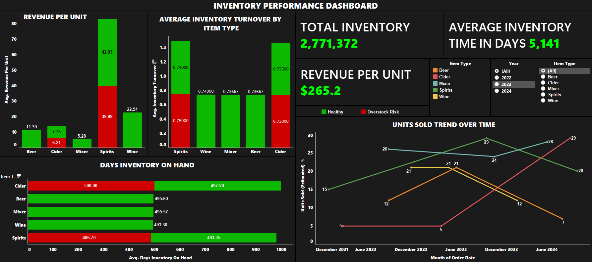

# Shelf Life: Analyzing Turnover & Overstock Risk in Retail Inventory

**Tools:** SQL · Excel · Tableau &nbsp;|&nbsp; **Dataset:** 44,000+ records &nbsp;|&nbsp; **Stock Value Analyzed:** $2.7M+

---

## Overview

This project analyzes inventory performance across a retail operation to identify slow-moving SKUs, quantify overstock risk, and surface actionable insights for buyers and inventory managers. Using a 44,000-row dataset, I cleaned raw data, engineered KPIs in SQL, and built a fully interactive Tableau dashboard to support markdown, delisting, and restocking decisions.

**[View Live Dashboard on Tableau Public →](https://public.tableau.com/app/profile/vedant.shinde2971/viz/Tableau_17434692686900/Dashboard)**

---

## Objective

Equip retail inventory teams with a clear, data-driven view of stock health — reducing overstock costs while maintaining product availability across categories and suppliers.

---

## Key Questions

- Which SKUs have been sitting longest without moving?
- Where is the business losing working capital to idle stock?
- Are overstock patterns concentrated in specific categories or suppliers?
- How does inventory turnover vary across product types?

---

## KPIs Tracked

| Metric | Description |
|---|---|
| Inventory Turnover Ratio | How often stock is sold and replaced over a period |
| Days Inventory Outstanding (DIO) | Average days a unit sits before selling |
| Revenue per Unit | Effective yield per SKU |
| Average Inventory Value | Capital tied up in stock at any point |
| Stock Status | Overstock Risk vs. Healthy classification per SKU |

---

## Process

### 1. Data Cleaning — Excel
- Standardized a 44,000-row raw dataset, resolving 1,000+ missing or inconsistent values
- Normalized categorical fields (`item_type`, `supplier`) for reliable grouping downstream

### 2. KPI Engineering — SQL
- Calculated inventory turnover, DIO, units sold, and revenue per unit at the SKU level
- Used regex validation to clean and verify numeric field formatting
- Flagged SKUs with 500+ days of holding time and identified **$180K+ in idle inventory** at dead stock risk

### 3. Dashboard — Tableau
- Built category- and supplier-level breakdowns using bar charts, line charts, and status flags
- Added year and product type filters for self-serve exploration by inventory managers and buyers

---

## Results

- Surfaced **$180K+ in excess inventory** at risk of becoming dead stock
- Identified high-DIO SKUs enabling targeted markdown and delisting decisions
- Delivered a reusable dashboard for ongoing inventory health monitoring across categories and suppliers

---

## Intended Users

Inventory & Supply Chain Managers · Category Buyers · Merchandising Teams · Finance Analysts

---

## Repository Contents

| File | Description |
|---|---|
| `Inventory_Analytics_Unclean.csv` | Raw source dataset |
| `inventory.csv` | Cleaned dataset |
| `Inventory_KPI.csv` | Calculated KPI summary |
| `Dashboard.png` | Tableau dashboard screenshot |
| `Tableau.twb` | Tableau workbook |
| `Project Objectives.docx` | Full project scope and goals |

---

## Data Source

[Warehouse and Retail Sales — Data.gov](https://catalog.data.gov/dataset/warehouse-and-retail-sales)
